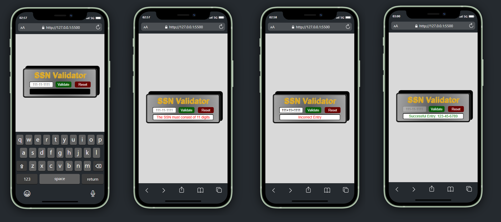

# SSN Validator

This is a simple SSN Validator application built with HTML, CSS, and JavaScript. It checks whether a Social Security Number (SSN) is valid according to standard formatting rules and displays appropriate messages based on user input.

## Ekran Görüntüleri

## Features:

- Validates SSN format: `xxx-xx-xxxx`
- Checks that the SSN doesn't start with invalid digits (e.g., `000`, `666`, or numbers >= `900`)
- Ensures the middle two digits and last four digits are not `0`
- Provides feedback on the validity of the entered SSN

## Technologies Used:

- **HTML**: Markup structure
- **CSS**: Styling and layout
- **JavaScript**: DOM manipulation and form validation

## License

This project is licensed under the [MIT](https://choosealicense.com/licenses/mit/) License
